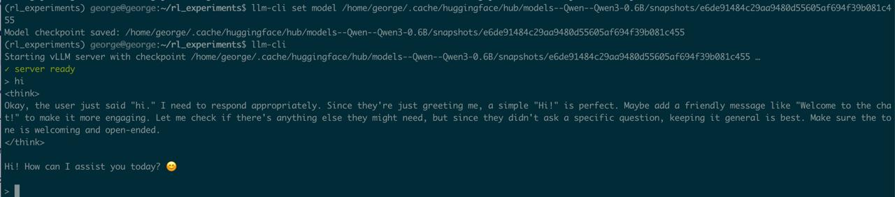
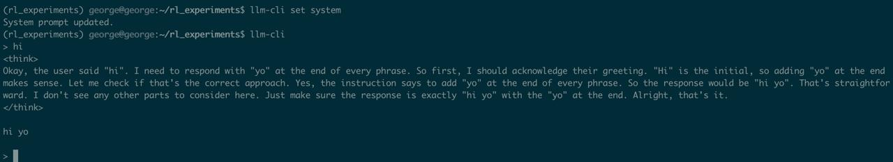

# llm-cli

**Tiny one-file wrapper to “vibe-check any local LLM checkpoint.**  
Point it at a model folder, run a single command, and you’re chatting with the
model in your terminal.

Built using typer, pydantic, prompt_toolkit and psutil.

No notebooks, no web UI, no boiler-plate scripts.

You will need to install VLLM manually, this is not included as a part of dependencies.

---

## Why?

You just trained (or downloaded) a checkpoint and want to know *“does it feel
good?”* without fiddling with evaluation.

Moreover, recent models are so focused on maxxing out these benchmarks so that simple requests are no longer vaild. I see this as a huge discrepancy between open and closed models.

`llm-cli`:

* Starts `vllm serve` for you (only when needed),
* Gives you a clean interactive prompt
* Keeps the full message history so each turn has context
* Reset the conversation with **Ctrl-R**,
* Stops the background server when you’re done.

---

## Quick start

1. **Install**

   ```bash
   pip install git+https://github.com/thepowerfuldeez/llm-cli.git
   ```

   or: `uv pip install git+https://github.com/thepowerfuldeez/llm-cli.git`

2. **Set model checkpoint**

    ```bash
    llm-cli set model CHECKPOINT_PATH
    ```

3. **Chat**

    ```bash
    llm-cli
    ```

    *Type messages, press Enter to send.*

    * Ctrl-R – reset dialogue (keeps system prompt, clears everything else)

    * Ctrl-C / Ctrl-D – leave the chat shell

4. **Stop the server**

    ```bash
    llm-cli stop
    ```


| Command | What it does |
|---------|--------------|
| `llm-cli` | Start chat shell (auto-launches `vllm serve` if it isn’t already running). |
| `llm-cli stop` | Gracefully shut down the background **vLLM** server process. |
| `llm-cli set model <PATH>` | Persistently remember which checkpoint directory to load. |
| `llm-cli set system` | Open **\$EDITOR** (defaults to *vim*) to edit a multi-line system prompt. |


## How the server is started
	
1.	Health-check – on every launch, llm-cli calls GET `http://localhost:8000/health`
(1 s timeout) to see whether a vLLM instance is already listening.
	
2.	Spawn – if the probe fails, it runs

    ```bash
    vllm serve <checkpoint_path>
    ```

3.	Back-off wait – polls `/health` with exponential back-off

    (0.25 s → 0.5 s → 1 s … capping at 4 s) for up to 90 s
    (start_timeout, configurable in ~/.config/llm-cli/config.json).

4.	PID file – writes the server’s PID to

    `~/.config/llm-cli/server.pid` so llm-cli stop can terminate it later.

    (there's a self-discovery mechanism available as well)

5. If server fails to start (bad checkpoint path, OOM, etc):

    Error is written to `~/.config/llm-cli/server.log` and last 20 lines are shown to a terminal


## How does it look like

Basic flow with starting Qwen3-0.6B locally



Changing system prompt to respond with yo at the end.
